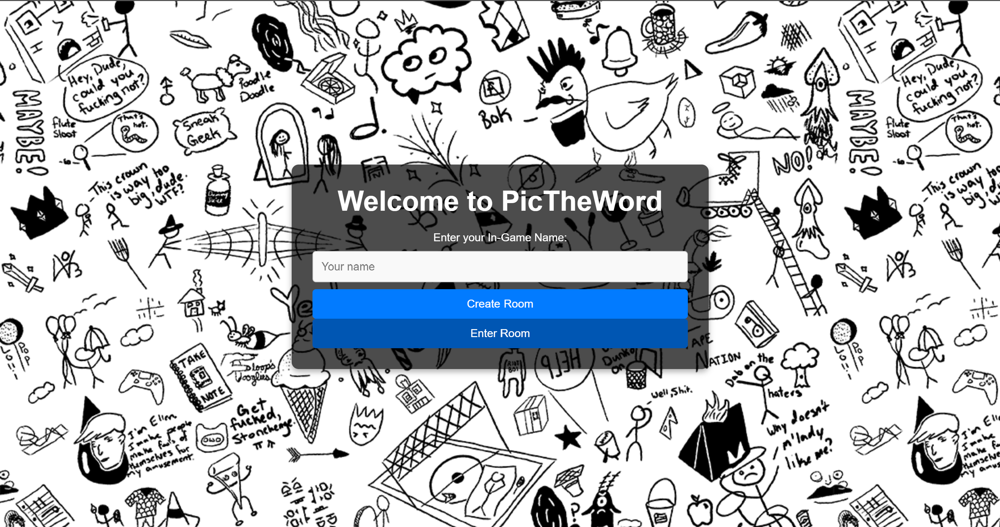
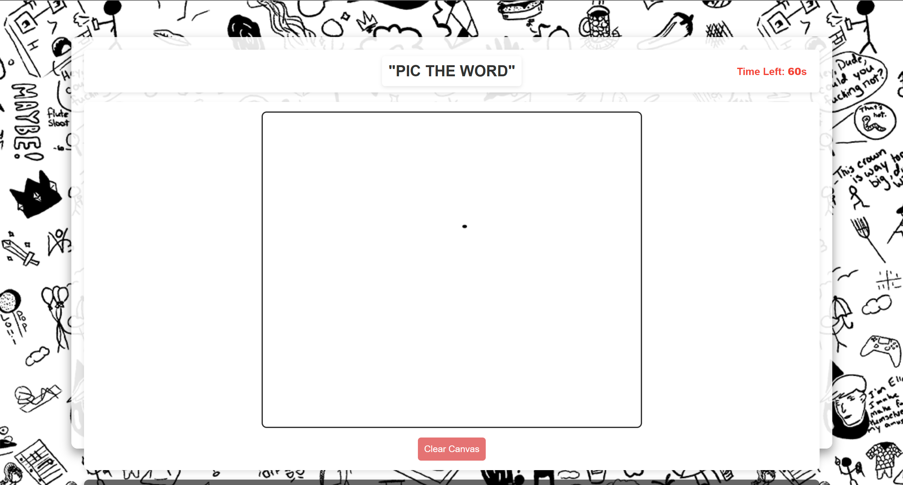

# 🎨 PictheWord - Prototype for Skribbl

A real-time multiplayer drawing and guessing game, inspired by Skribbl.io — built with PHP, WebSockets, and MySQL.  
Players take turns drawing while others guess the word. The first to guess gets the most points!

---

## 🚀 Features

- ✅ Create and join game rooms
- ✏️ Live drawing canvas
- 🧠 Word guessing with score tracking
- 🔄 Real-time communication using WebSockets
- 📦 PHP backend with MySQL database
- 🎨 Clean HTML/CSS frontend

---

## 🛠️ Tech Stack

- **Frontend**: HTML, CSS, JavaScript
- **Backend**: PHP
- **WebSocket Server**: [Ratchet](http://socketo.me/)
- **Database**: MySQL
- **Package Manager**: Composer

---

## 📷 Screenshots

### 🛠️ Login Game Page

### 🛠️ Create Game Page

### 🛠️ Main Game Page

## 📌 To-Do / Improvements

- [ ] Add chat feature
- [ ] Improve mobile responsiveness
- [ ] Add game timer and animations
- [ ] Deploy live online

---